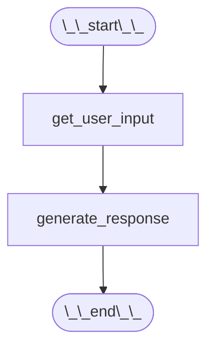
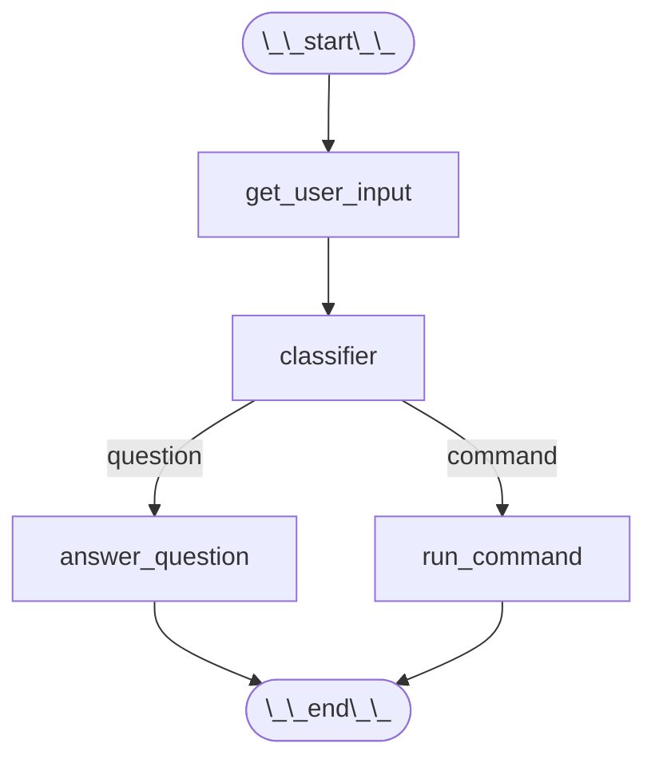
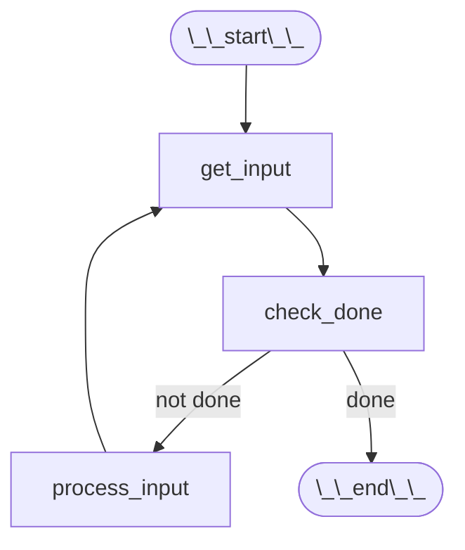

# Custom Graphs: Advanced RAG Workflows

This guide explores how to extend Maeser’s default pipelines by building **custom LangGraph graphs**. Beyond the built‑in Simple, Pipeline, and Universal RAG graphs, you can create multi‑step workflows, integrate external tools, and implement conditional logic to tailor AI tutoring experiences to your needs.

---

## Prerequisites

- A **Maeser development environment** set up ([**Development Setup**](./development_setup.md)).
- **Familiarity with Maeser's built-in RAG workflows**. (Return to [**Graphs: Simple RAG, Pipeline RAG, and Universal RAG**](./graphs.md) if you aren't familiar.)

---

## Why Build Custom Graphs?

While **Universal RAG** can query multiple domains, real‑world tutoring often requires:

- **Multi‑step Reasoning**: Break complex queries into sub‑questions or tool calls (e.g., math calculations).
- **Conditional Branching**: Route a question based on classification or user input before retrieval.
- **Tool Integration**: Connect calculators, external APIs, or verification checks mid‑workflow.
- **Dynamic Prompts**: Adapt system messages based on intermediate results or user feedback.

Custom graphs let you compose these behaviors into a coherent pipeline, giving you full control over your tutoring logic.

---

## Building a Custom Graph with LangGraph

The easiest way to build a **custom graph** is to use the web tool [**LangGraph Builder**](https://build.langchain.com/). We will try to explain a LangGraph here:

---

## Nodes

In LangGraph, a node is like a building block — it’s one step in your program’s flow.

More technically:

- A node is a function or a tool that takes some input, does something (like calling a model, running code, or checking a condition), and then returns an output.
- You connect nodes together to form a graph — kind of like a flowchart — where each node passes its result to the next one.

Consider a simple AI chatbot that takes in a user's input and generates a response. A LangGraph for such a chatbot would look like the following:



- **get_user_input:** receives the user’s question.
- **generate_response:** – passes the user's question to an LLM to generate a response.

Here is how those nodes may be implemented in python:

```python
def get_user_input(state):
    return {"question": state["user_input"]}

def llm_response_node(state):
    answer = llm.invoke(state["question"])
    return {"answer": answer}
```

---

## Edges

An edge is the connection between two nodes.

Think of it like a wire or a path that tells LangGraph:
"After this node finishes, go to that one."

When a node finishes its job and returns some output, the edge decides what node to run next.

There are two main types of edges:

- **Static Edges:** Always go to the same next node, no matter the result.
- **Conditional Edges:** Choose the next node based on some value in the output. See [**Conditional Edges**](#conditional-edges) for more information.

Let’s say you’re building a flow like this:



- User types a message (`get_user_input` node).
- Classify message as 'question' or 'command' (`classifier` node).
- If it's a question, go to `answer_question` node and answer the user's question.
- If it's a command, go to `run_command` node and execute the command.

Here’s what’s happening:

- Each node does some work.
- Each edge tells the system where to go next.
- The edge from `get_user_input` to `classifier` is a static edge — it always goes to `classifier`, no matter the output.
- The edge from `classifier` is a conditional edge — it chooses the next node based on the output.

---

## Conditional Edges

A conditional edge chooses which node to run next based on the output of the current node.

It’s like saying:

- "If the result is X, go this way.
- If the result is Y, go that way."

They let your graph make decisions.

This is useful when:

- You want to branch the logic based on input.
- You’re handling different types of tasks (e.g. questions vs commands).
- You want to loop or exit based on a condition.

Let's take the example of classify a user's input from earlier. An implementation of this node and conditional edge may look like the following:

```python
def classifier_node(state):
    text = state["user_input"]
    if "?" in text:
        return {"type": "question"}
    else:
        return {"type": "command"}

def classifier_node_conditional_edge(state) -> str:
    input_type = state["type"]
    if input_type == "question":
        return "answer_question"
    else:
        return "run_command"
```

`classifier_node_conditional_edge()` handles the conditional edge logic and returns the string representation of the next node to traverse to.

---

## Cycles

A cycle in LangGraph is when a node can eventually lead back to itself or to an earlier node in the graph.
In simple terms, A cycle lets your program loop or repeat steps.

You use cycles when:

- You want to retry something.
- You want to keep asking the user for more input.
- You need a multi-step process where results feed back into earlier logic.

Logic for this would look something like this:



---

## Best Practices & Tips

- **Design for Clarity**: Keep branches simple; avoid excessive states.
- **Reuse Components**: Leverage `simple_retrieve`, `llm_generate`, and other utility functions.
- **Manage Memory**: Pass `memory_filepath` to `sessions_manager` if you need state across turns.
- **Test Iteratively**: Build and test each branch separately before combining.

---

## Next Steps

- Read [**Graphs**](./graphs.md) to learn more about Maeser's built‑in RAG graphs.
- For more information on LangGraphs, you can [**find documentation here**](https://langchain-ai.github.io/langgraph/?_gl=1*1a1ptos*_ga*MTA4OTcxNDQ3OS4xNzQ3NzUyMzU1*_ga_47WX3HKKY2*czE3NDc3NTIzNTQkbzEkZzEkdDE3NDc3NTIzNjgkajAkbDAkaDA.#).
- Experiment with external tools (e.g., web search) by adding new states.
- Share your custom graphs with the Maeser community via [**GitHub**](https://github.com/byu-cpe/Maeser).
