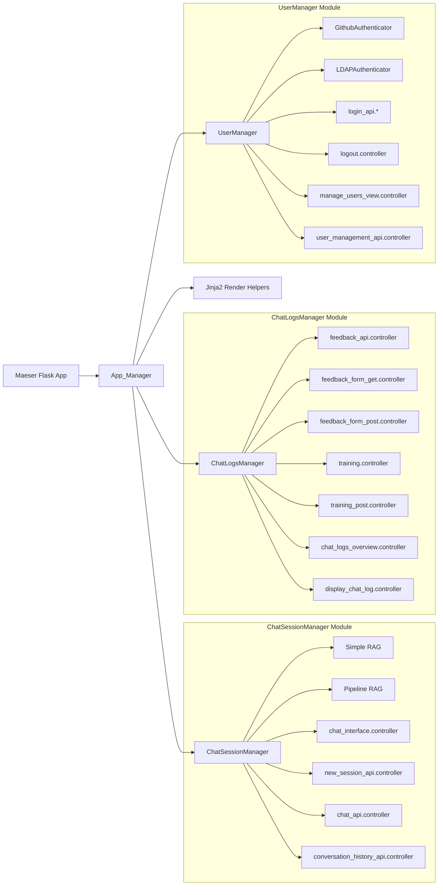

# Architecture Overview

This document provides a detailed walkthrough of Maeser’s core architecture. At the center is the **App_Manager**, which initializes and connects all major modules. Below is a graphical representation, followed by explanations of each component and how they interact.

## Core Components

### App_Manager
- **File:** `maeser/blueprints.py`  
- **Role:** Bootstraps and configures the Flask app, registers routes via blueprints, applies theming, and initializes background tasks (e.g., quota refresh). Everything flows through this central orchestrator.

### ChatSessionManager Module
- **Class:** `ChatSessionManager` (`maeser/chat/chat_session_manager.py`)  
- **Responsibilities:** Manages conversation sessions, routes messages to the appropriate RAG graph, and tracks session metadata.
- **Subcomponents:**
  - **Simple RAG** (`get_simple_rag`): Single-domain retrieval and generation pipeline.
  - **Pipeline RAG** (`get_pipeline_rag`): Multi-domain or routed retrieval pipeline.
- **Controllers:**
  - `chat_interface.controller` (renders UI)
  - `new_session_api.controller` (creates sessions)
  - `chat_api.controller` (handles messages)
  - `conversation_history_api.controller` (fetches past messages)

### ChatLogsManager Module
- **Class:** `ChatLogsManager` (`maeser/chat/chat_logs.py`)  
- **Responsibilities:** Persists all chat logs, including messages, responses, tokens, and cost metrics.
- **Controllers:**
  - `feedback_api.controller` (submit feedback)
  - `feedback_form_get.controller` / `feedback_form_post.controller` (render and process feedback forms)
  - `training.controller` / `training_post.controller` (render and process training data)
  - `chat_logs_overview.controller` (overview of logs)
  - `display_chat_log.controller` (stream a specific log)

### UserManager Module
- **Class:** `UserManager` (`maeser/user_manager.py`)  
- **Responsibilities:** Handles authentication (OAuth, LDAP), user registration, admin/ban status, and rate limiting.
- **Authenticators:**
  - `GithubAuthenticator`
  - `LDAPAuthenticator`
- **Controllers:**
  - `login_api.*` (login/logout routes)
  - `logout.controller`
  - `manage_users_view.controller` (admin UI)
  - `user_management_api.controller` (user CRUD API)

### Jinja2 Render Helpers
- **File:** `maeser/render.py`  
- **Role:** Provides helper functions for Jinja2 templates to render CSS, HTML snippets, and inject dynamic theming variables.

## Request Flow Summary
1. **HTTP Request** arrives at the Flask app.  
2. **App_Manager** routes the request to the proper controller.  
3. **Controllers** interact with **ChatSessionManager** or **UserManager** depending on the endpoint.  
4. **ChatSessionManager** invokes RAG graphs or logs via **ChatLogsManager** for chat operations.  
5. **UserManager** authenticates and manages user data for secure endpoints.  
6. **Render Helpers** generate final HTML/CSS for web responses.

This architecture ensures clear separation of concerns, scalability of RAG pipelines, and maintainable code structure.

