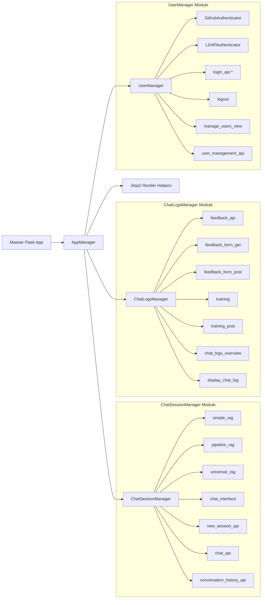

# Architecture Overview

This document provides a detailed walkthrough of Maeser’s core architecture. At the center is the **AppManager**, which initializes and connects all major modules. Below is a graphical representation of the class hierarchy:

## Core Components

### AppManager

- **Class:** `AppManager` (`maeser/flask_app/blueprints.py`)
- **Role:** Bootstraps and configures the Flask app, registers routes via blueprints, applies theming, and initializes background tasks (e.g., message requests refresh).

### ChatSessionManager Module

- **Class:** `ChatSessionManager` (`maeser/chat/chat_session_manager.py`)  
- **Responsibilities:** Manages conversation sessions, routes messages to the appropriate RAG graph, and tracks session metadata.
- **Subcomponents:**
  - **Simple RAG** (`get_simple_rag`): Controls chatbot behavior by separating each vector store into its own branch, forcing the chatbot to stick to one topic per conversation.
  - **Pipeline RAG** (`get_pipeline_rag`): Combines all vector stores into one chat branch, allowing the chatbot to dynamically choose the most relevant vector store when answering a user's question.
  - **Universal RAG** (`get_universal_rag`): Behaves similar to `get_pipeline_rag`, but also allows the chatbot to pull from multiple vector stores when answering a user's question.
- **Controllers:**
  - `chat_interface.controller` (renders UI)
  - `new_session_api.controller` (creates sessions)
  - `chat_api.controller` (handles messages)
  - `conversation_history_api.controller` (fetches past messages)

### ChatLogsManager Module

- **Class:** `ChatLogsManager` (`maeser/chat/chat_logs.py`)  
- **Responsibilities:** Persists all chat logs, including messages, responses, tokens, and cost metrics.
- **Controllers:**
  - `feedback_api.controller` (submit feedback)
  - `feedback_form_get.controller` / `feedback_form_post.controller` (render and process feedback forms)
  - `training.controller` / `training_post.controller` (render and process training data)
  - `chat_logs_overview.controller` (overview of logs)
  - `display_chat_log.controller` (stream a specific log)

### UserManager Module

- **Class:** `UserManager` (`maeser/user_manager.py`)  
- **Responsibilities:** Handles authentication (OAuth, LDAP), user registration, admin/ban status, and rate limiting.
- **Authenticators:**
  - `GithubAuthenticator`
  - `LDAPAuthenticator`
- **Controllers:**
  - `login_api.*_controller` (login/logout routes)
  - `logout.controller`
  - `manage_users_view.controller` (admin UI)
  - `user_management_api.controller` (user CRUD API)

### Jinja2 Render Helpers

- **File:** `maeser/render.py`  
- **Role:** Provides helper functions for Jinja2 templates to render CSS, HTML snippets, and inject dynamic theming variables.

## Request Flow Summary

1. **AppManager** configures all routes to their proper controllers.
1. **HTTP Request** arrives at the Flask app and is routed to its proper controller.
1. **Controllers** interact with **ChatSessionManager** or **UserManager** depending on the endpoint.  
1. **ChatSessionManager** invokes RAG graphs or logs via **ChatLogsManager** for chat operations.  
1. **UserManager** authenticates and manages user data for secure endpoints.  
1. **Render Helpers** generate final HTML/CSS for web responses.
