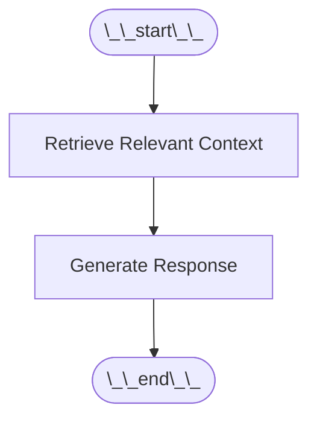
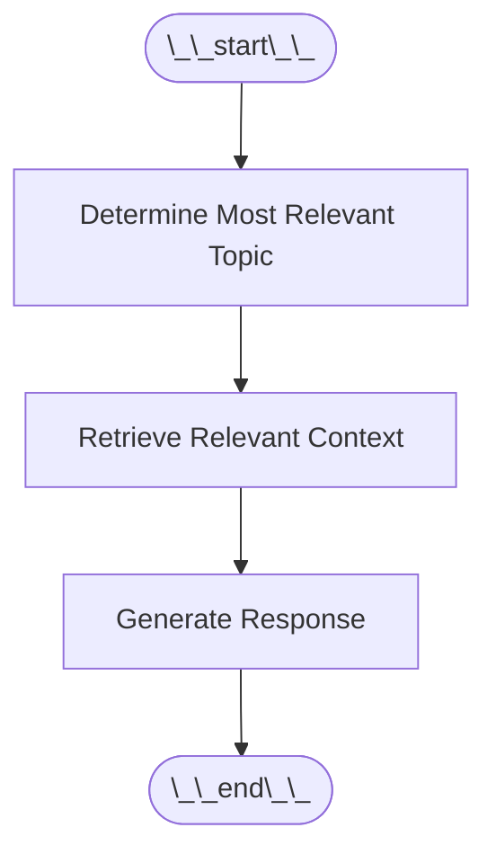
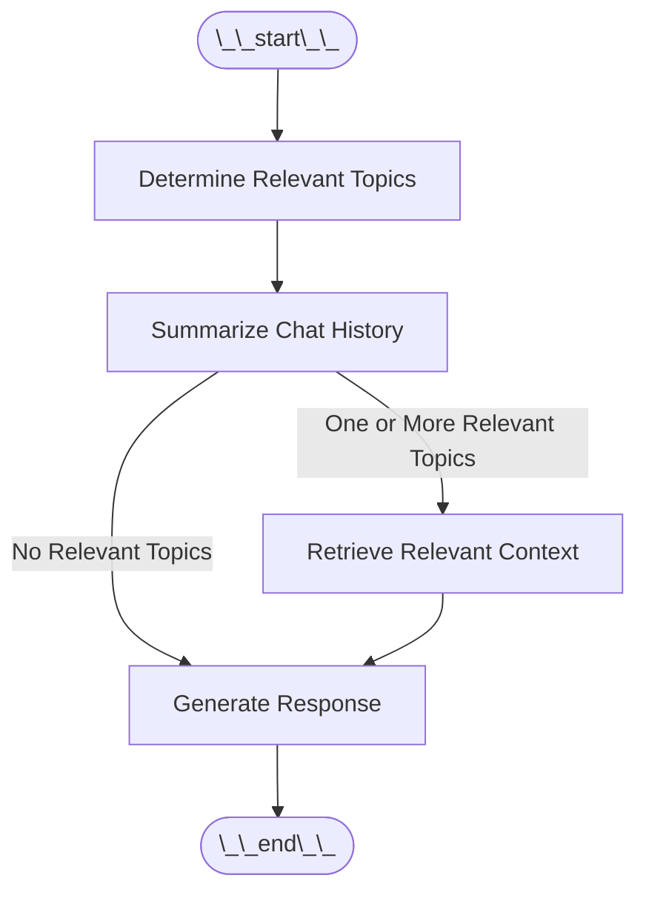

# Graphs: Simple RAG, Pipeline RAG, and Universal RAG

This guide provides a deep dive into Maeser’s Retrieval‑Augmented Generation (RAG) graphs—**Simple RAG**, **Pipeline RAG**, and **Universal RAG**—with guidance on when to use each graph. By the end of this guide, you’ll know when and how to choose each approach.

The following is a good rule of thumb for most use cases:

- If your application only uses one vector store, use the [**Simple RAG**](#simple-rag) approach.
- If your application uses more than one vector store, use the [**Universal RAG**](#universal-rag) approach.

This guide provides a description for each RAG graph but does not provide examples. For working implementations of each RAG graph, see the scripts in `example/apps/` and [**Maeser Example (with Flask & User Management)**](./flask_example.md).

---

## Prerequisites

- A Maeser development environment configured (see [**Development Setup**](./development_setup.md)).
- At least one prebuilt vector store (for Simple RAG) or multiple vector stores (for Pipeline or Universal RAG). Two example vector stores—`byu` and `maeser`—are provided in `example/resources/vectorstores/`. To create a vector store with your own content, see [**Embedding New Content**](./embedding.md).

---

## Simple RAG

The Simple RAG only takes in one vector store per **chat branch**, forcing the chatbot to stick to one topic per conversation.

### When to Use Simple Rag

Simple Rag is the best choice when:

- Your application or centers around one domain or subject.
- You want minimal complexity and fast responses.

### Simple RAG Framework

- **Retrieve Relevant Context**: Scans the vector store for passages related to the user's question and retrieves the most relevant document chunks.
- **Generate Response**: Invokes the LLM with the **conversation history**, **prompt instructions**, and **retrieved context** as input, yielding a focused response.

### Limitations of Simple RAG

- **Only One Vector Store:** All content used by the chatbot must be embedded into a single vector store. This will require you to compile your dataset of resources into one vector store and rebuild this vector store any time you make changes to your dataset.

---

## Pipeline RAG

The Pipeline RAG takes in multiple vector stores per chat branch, allowing the chatbot to dynamically choose the most relevant vector store when answering a user's question.

> **Note:** In almost all cases, [**Universal RAG**](#universal-rag) is a better option compared to Pipeline RAG.

### When to use Pipeline RAG

Pipeline RAG is the best choice when:

- Your application spans multiple knowledge bases—such as data from homework, labs, and textbooks.
- Your chatbot needs to dynamically switch between knowledge bases depending on the question it is asked.

### Pipeline RAG Framework

- **Determine Most Relevant Topic**: Classifies the student’s question (e.g., “Is this a lab or homework question?”) to choose which vector store to query.
- **Retrieve Relevant Context**: Scans the chosen vector store for passages related to the user's question and retrieves the most relevant document chunks.
- **Generate Response**: Invokes the LLM with the **conversation history**, **prompt instructions**, and **retrieved context** as input, yielding a focused response.

### Limitations of Pipeline RAG

- **More LLM Calls:** Invokes the LLM to identify most relevant vector store before retrieving context, resulting in a slightly higher cost and response time per message (compared to Simple RAG).
- **One Vector Store Per Message:** If the user asks a question relating to multiple vector stores, the chatbot is limited to only using one of the vector stores in its retrieval step. (Ex: If the user asks a question related to both the homework and the textbook, the chatbot can retrieve context from either the homework vector store or textbook vector store, but not both.)

---

## Universal RAG

Like the Pipeline RAG, the Universal RAG takes in multiple vector stores per chat branch, but unlike the Pipeline RAG, it can retrieve from multiple vector stores simultaneously, allowing the chatbot to use as many vector stores as needed to answer a user's question.

### When to use Universal RAG

Universal RAG is the best choice when:

- Your application spans multiple knowledge bases—such as data from homework, labs, and textbooks.
- Your chatbot needs to dynamically choose which knowledge bases to pull from depending on the question it is asked.

### Universal RAG Workflow

- **Determine Relevant Topics**: Classifies the student’s question and to create a list of the most relevant vector stores to query.
- **Summarize Chat History**: Summarizes the recent chat history to provide more relevant input during the Generate Response step.
- **Retrieve Relevant Context**: Scans each vector store in the list provided for passages related to the user's question and retrieves the most relevant document chunks.
- **Generate Response**: Invokes the LLM with the **summarized chat history**, **prompt instructions**, and **retrieved context** as input, yielding a focused response.

### Limitations of Universal RAG

- **More LLM Calls:** Invokes the LLM to identify most relevant vector stores before retrieving context and summarizes chat before generating a response, resulting in a slightly higher cost and response time per message (compared to Simple RAG).

---

## RAG Graph Comparison Table

Feature | Simple RAG | Pipeline RAG | Universal RAG
:---|:---|:---|:---
Vector Store Capacity | Single | Multiple | Multiple
Context Synthesis | One context | One context (chosen by relevance) | Multiple contexts (one per relevant topic)
Retrieval Steps | 1 | 1 | 1+ (1 per relevant topic)
LLM Calls per Response | 2 | 3 | 3 + Number of Relevant Topics/Contexts

---

## Next Steps

- Review the scripts in `example/apps/` and [**Maeser Example (with Flask & User Management)**](./flask_example.md) for implementations of each RAG graph.
- Explore **Custom Graphs** for tool integration (e.g., calculators) in [Custom Graphs: Advanced RAG Workflows](custom_graphs).
